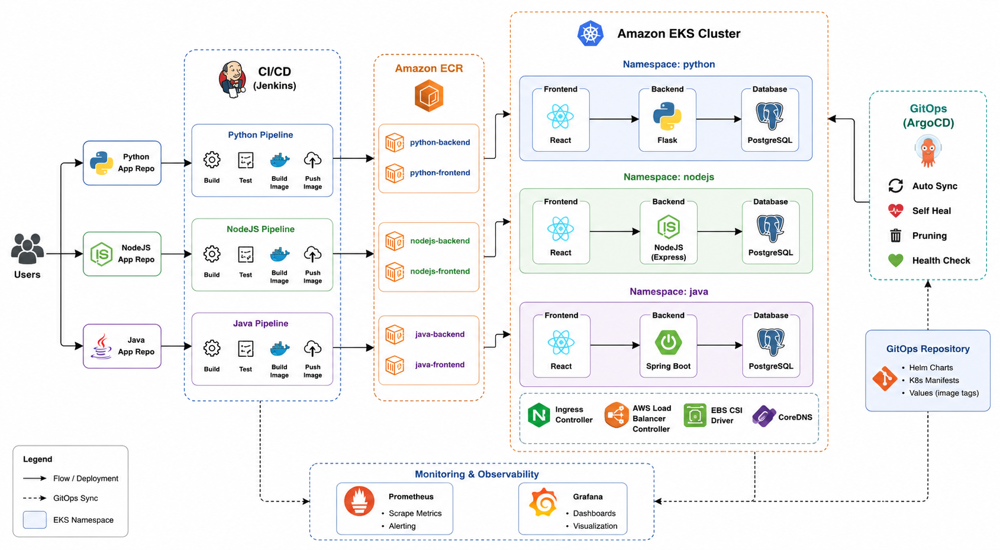
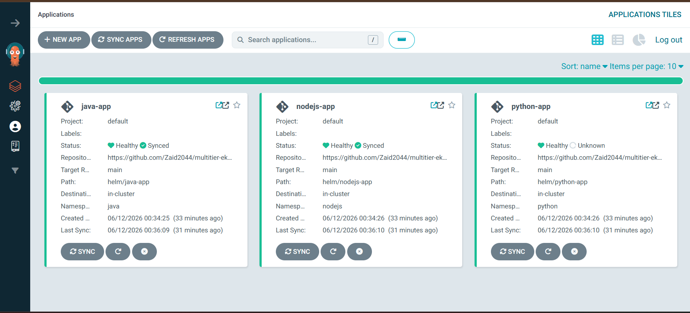

# Multi-Tier EKS GitOps Repository

## Overview

This repository serves as the **GitOps source of truth** for deploying and managing multiple applications on Amazon EKS using **ArgoCD** and **Helm**.

The repository contains Kubernetes deployment configurations, Helm charts, and application manifests used by ArgoCD to continuously synchronize workloads into the EKS cluster.

Whenever Jenkins completes a successful build:

1. Docker images are pushed to Amazon ECR.
2. Jenkins updates image tags inside Helm values files.
3. Jenkins commits and pushes changes to this repository.
4. ArgoCD automatically detects changes.
5. ArgoCD synchronizes the cluster.
6. New application versions are deployed to Amazon EKS.

This implementation follows GitOps principles where **Git becomes the single source of truth for Kubernetes deployments.**

---

# GitOps Architecture



## Deployment Flow

```text
Application Repository
        │
        ▼
Jenkins CI Pipeline
        │
        ▼
Amazon ECR
        │
        ▼
Update Helm Values
        │
        ▼
GitOps Repository
        │
        ▼
ArgoCD
        │
        ▼
Amazon EKS
```

---

# GitOps Workflow

## Step 1 – Developer Pushes Code

A developer pushes changes to one of the application repositories:

```text
Python Inventory Management
NodeJS Task Management
Java Employee Portal
```

---

## Step 2 – Jenkins Builds Images

Jenkins performs:

```text
Checkout Source
Build Backend Image
Build Frontend Image
Push Images to ECR
```

Example:

```text
python-backend:af7e7dc
python-frontend:af7e7dc

nodejs-backend:594e979
nodejs-frontend:594e979

java-backend:f8b2366
java-frontend:f8b2366
```

---

## Step 3 – Jenkins Updates GitOps Repository

Jenkins automatically updates image tags inside Helm values files.

Example:

Before:

```yaml
backend:
  image:
    repository: 234273295663.dkr.ecr.ap-south-1.amazonaws.com/python-backend
    tag: b7786fa
```

After:

```yaml
backend:
  image:
    repository: 234273295663.dkr.ecr.ap-south-1.amazonaws.com/python-backend
    tag: af7e7dc
```

---

## Step 4 – Commit to GitOps Repository

Jenkins creates deployment commits.

Example:

```text
Deploy Python af7e7dc
Deploy NodeJS 594e979
Deploy Java f8b2366
```

Each commit represents a deployable Kubernetes state.

---

## Step 5 – ArgoCD Detects Changes

ArgoCD continuously watches this repository.

When new commits are detected:

```text
Compare Desired State
Compare Live State
Generate Diff
Sync Resources
```

---

## Step 6 – Kubernetes Cluster Updated

ArgoCD deploys updated images into Amazon EKS.

Applications are automatically rolled out without manual kubectl commands.

---

# ArgoCD Deployment



## Managed Applications

The following applications are managed through ArgoCD:

| Application | Namespace |
|------------|------------|
| python-app | python |
| nodejs-app | nodejs |
| java-app | java |

---

# ArgoCD Features Used

## Automated Synchronization

ArgoCD automatically deploys changes whenever new commits are pushed.

```yaml
syncPolicy:
  automated: {}
```

---

## Self Healing

If cluster resources drift from Git state:

```text
Git State
     ≠
Cluster State
```

ArgoCD automatically restores the correct configuration.

---

## Automated Pruning

Unused resources are automatically removed.

Example:

```text
Deployment removed from Git
        ↓
ArgoCD detects removal
        ↓
Deployment removed from EKS
```

---

## Namespace Creation

Namespaces are automatically created if missing.

```yaml
syncOptions:
  - CreateNamespace=true
```

---

# Helm-Based Deployments

Each application is deployed using Helm.

Benefits:

- Reusable templates
- Parameterized values
- Easier upgrades
- Environment-specific configurations

---

# Repository Structure

```text
multitier-eks-gitops
│
├── applications
│   ├── python-app.yaml
│   ├── nodejs-app.yaml
│   └── java-app.yaml
│
├── helm
│   │
│   ├── python-app
│   │   ├── templates
│   │   ├── Chart.yaml
│   │   └── values.yaml
│   │
│   ├── nodejs-app
│   │   ├── templates
│   │   ├── Chart.yaml
│   │   └── values.yaml
│   │
│   └── java-app
│       ├── templates
│       ├── Chart.yaml
│       └── values.yaml
│
├── diagrams
│   ├── architecture-flow.png
│   └── argocd-applications.png
│
└── README.md
```

---

# Application Architecture

Each application follows a 3-tier design.

```text
Frontend
   │
   ▼
Backend API
   │
   ▼
PostgreSQL
```

Namespaces:

```text
python
nodejs
java
```

---

# Helm Value Management

Image tags are dynamically updated by Jenkins.

Example:

## Python

```yaml
backend:
  image:
    repository: python-backend
    tag: af7e7dc
```

## NodeJS

```yaml
backend:
  image: nodejs-backend
  tag: 594e979
```

## Java

```yaml
backend:
  image: java-backend
  tag: f8b2366
```

This ensures every deployment is traceable to a specific Git commit.

---

# Benefits of GitOps

## Version Controlled Infrastructure

Every deployment change is stored in Git.

---

## Auditability

Deployment history can be viewed using:

```bash
git log
```

---

## Rollbacks

Rollback simply requires:

```bash
git revert <commit>
git push
```

ArgoCD automatically restores the previous version.

---

## Declarative Deployments

Cluster state is fully described through YAML and Helm charts.

---

## Continuous Reconciliation

ArgoCD continuously ensures:

```text
Desired State == Actual State
```

---

# Deployment Process Example

```text
Developer Pushes Code
          │
          ▼
Jenkins Pipeline
          │
          ▼
Docker Build
          │
          ▼
Push Image to ECR
          │
          ▼
Update values.yaml
          │
          ▼
Commit to GitOps Repo
          │
          ▼
ArgoCD Detects Change
          │
          ▼
Sync to EKS
          │
          ▼
New Version Running
```

---

# GitOps Principles Implemented

- Declarative Configuration
- Version Controlled Deployments
- Continuous Reconciliation
- Automated Synchronization
- Automated Rollback Capability
- Immutable Image Tags
- Helm-Based Kubernetes Deployments
- Namespace Isolation
- Multi-Application Management

---

# Technologies Used

## GitOps

- ArgoCD

## Packaging

- Helm

## Container Registry

- Amazon ECR

## CI/CD

- Jenkins

## Container Runtime

- Docker

## Kubernetes

- Amazon EKS

---

# Related Repository

Infrastructure provisioning repository:

```text
multitier-eks-infra
```

Contains:

- Terraform
- EKS Cluster
- ECR
- Jenkins
- Prometheus
- Grafana
- AWS Infrastructure

---

# Author

**Mohammed Zaid Ahmed**

This repository demonstrates a complete GitOps implementation using ArgoCD and Helm for managing multiple production-style applications on Amazon EKS.